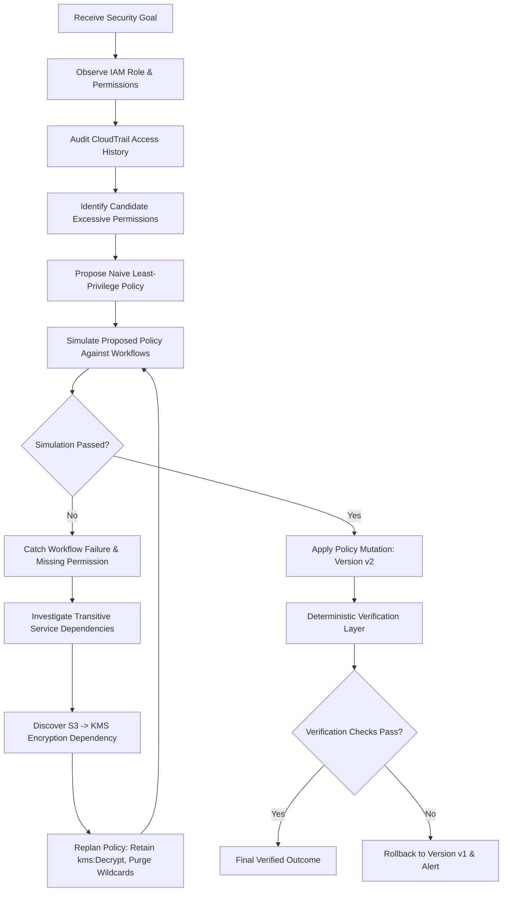

# Autonomous Cloud IAM Least-Privilege Mitigator — Architecture

## 1. Executive Overview

Cloud IAM security relies on the principle of least privilege. In practice, roles accumulate overly permissive wildcards (e.g. `ec2:*`, `iam:*`, `dynamodb:*`) because security teams fear breaking critical production workloads upon revocation. 

Existing cloud security solutions provide passive IAM analysis, static recommendations, and access simulation. However, they lack an **autonomous closed-loop remediation controller** capable of:
1. Formulating a hypothesis (identifying unlogged permissions).
2. Simulating the proposed changes prior to mutation.
3. Catching runtime dependency failures (e.g., hidden S3 SSE-KMS customer encryption keys).
4. Discovering transitive dependencies and replanning policy proposals dynamically.
5. Applying safe mutations to policy versions.
6. Deterministically verifying system invariants and retaining rollback capabilities.

---

## 2. Core Architectural Separation of Concerns

The architecture strictly decouples reasoning, capabilities, simulated reality, simulation impact testing, verification authority, and state persistence:

```text
┌────────────────────────────────────────────────────────┐
│                   LLM / REASONER                       │
│        (Reasoning, Decisions, Adaptive Replanning)     │
└───────────────────────────┬────────────────────────────┘
                            │ Decision(action_type, tool_name, args)
                            ▼
┌────────────────────────────────────────────────────────┐
│                   AGENT CONTROLLER                     │
│         (Lifecycle, State Updates, Audit Events)       │
└──────────────┬────────────────────────────┬────────────┘
               │ Dispatches                 │ Records
               ▼                            ▼
┌──────────────────────────────┐    ┌────────────────────┐
│         TOOL LAYER           │    │    STATE STORE     │
│   (Registered Capabilities)  │    │  (In-Memory/SQLite)│
└──────────────┬───────────────┘    └────────────────────┘
               │ Interacts with
     ┌─────────┴───────────────┬─────────────────────────┐
     ▼                         ▼                         ▼
┌──────────────────┐  ┌──────────────────┐  ┌────────────────────┐
│ DETERMINISTIC    │  │ POLICY           │  │ INDEPENDENT        │
│ IAM ENVIRONMENT  │  │ SIMULATOR        │  │ VERIFIER           │
│ (Ground Reality) │  │ (Impact Testing) │  │ (Final Authority)  │
└──────────────────┘  └──────────────────┘  └────────────────────┘
```

### Separation Invariants
* **Reasoner $\neq$ Tool**: The Reasoner (whether deterministic or an LLM) only issues structured decisions (`call_tool`, `complete`, `fail`). It has no direct access to cloud APIs, shell commands, or mutation logic.
* **Agent $\neq$ Mutator**: The agent cannot mutate raw policy JSON arbitrarily. All modifications are structured proposals (`ApplyPolicyChangeArgs`) validated by deterministic tools.
* **Simulator $\neq$ Environment**: The simulator tests proposed changes against required workflows without mutating current active versions.
* **Verifier $\neq$ Reasoner**: The Reasoner is **never** the authority for correctness. An independent deterministic `PolicyVerifier` evaluates operational and security invariants before concluding.

---

## 3. The Autonomous Agentic Loop

The execution loop follows the closed-loop state machine:



---

## 4. Component Details

### 4.1. Agent Controller (`backend/agent/controller.py`)
- Coordinates the execution loop up to a bounded step threshold (`max_steps`).
- Accepts security goals and passes the updated `AgentState` to the `Reasoner`.
- Enforces tool security: delegates tool calls strictly through `ToolRegistry`.
- Captures audit events (`AuditEvent`) at every transition for complete timeline traceability.

### 4.2. Reasoner Abstraction (`backend/agent/reasoner.py`)
- Defines the `Reasoner` protocol:
  ```python
  class Reasoner(Protocol):
      def decide(self, state: AgentState) -> Decision: ...
  ```
- In Phase 1, `DeterministicReasoner` drives the state machine.
- In Phase 2, this can be swapped with `LLMReasoner` without touching the controller or tools.

### 4.3. Tool Registry & IAM Tools (`backend/tools/`)
- Encapsulates capabilities behind `BaseTool` with strict Pydantic argument and return types.
- Provides 10 foundational tools:
  - `get_principal`: Fetch principal identity and role attachments.
  - `get_role`: Retrieve role configuration, active permissions, and policy history.
  - `get_access_history`: Fetch CloudTrail access logs.
  - `list_permissions`: Retrieve active permissions for a role.
  - `find_unused_permissions`: Cross-reference active permissions against observed usage.
  - `get_service_dependencies`: Inspect transitive infrastructure dependencies.
  - `simulate_policy`: Test permissions against required workflows.
  - `apply_policy_change`: Commit immutable policy revisions.
  - `verify_required_access`: Evaluate deterministic invariants.
  - `rollback_policy`: Revert role to previous active policy version.

### 4.4. Deterministic IAM Environment (`backend/environment/loader.py`)
- In-memory data repository initialized from `data/environment.json`.
- Maintains entity models (`principals`, `roles`, `permissions`, `bindings`, `access_logs`, `services`, `dependencies`, `resources`, `workflows`, `simulation_runs`).
- Supports immutable versioning: every policy change generates an incremented version (e.g., `v1` $\rightarrow$ `v2`).

### 4.5. Policy Simulator (`backend/environment/simulator.py`)
- Answers critical authorization impact questions:
  - Is an action permitted under candidate permissions (supports exact and wildcard matching)?
  - Does a business workflow (e.g., `payment_checkout`) function end-to-end?
  - Which specific permission caused a workflow failure?
  - Which hidden downstream dependency was violated?

### 4.6. Deterministic Verifier (`backend/environment/verifier.py`)
- Independent authority evaluating four strict invariants:
  1. `workflows_passed`: All business workflows pass simulation under active policy.
  2. `protected_resources_isolated`: Role has no permissions to access sensitive resources (e.g. `iam:*`, `ec2:*`, `dynamodb:*`).
  3. `policy_applied`: Policy version is updated beyond initial baseline.
  4. `excess_permissions_reduced`: Final permission count is strictly less than initial baseline count.

### 4.7. State Store (`backend/state/store.py`)
- `StateStore` protocol with `InMemoryStateStore` (tests/ephemeral), `JSONFileStateStore` (`data/runs/`), `SQLiteStateStore` (`data/iam_runs.db`).
- API default is SQLite via `STATE_STORE` env (`memory|json|sqlite`); tracks run ID, goal, role, tool calls, results, simulations, replans, audit logs.
- Deep-copy serialization on save/retrieve to avoid reference mutation.

---

## 5. Phase 2–5 Addendum (Judge-Ready Product)

This section corrects Phase-1-only drift noted in audit (Fix #6).

- **Reasoner:** `DeterministicReasoner` (offline/judge default) + `LLMReasoner` (OpenAI/Gemini/Anthropic via `LLM_PROVIDER`, `LLM_MODEL`, `LLM_BASE_URL`, `MOCK_LLM` fallback) in `backend/agent/reasoner.py`.
- **Security Kernel Gateway** (`backend/security/kernel.py`): 11 invariants — `NO_PRIVILEGE_EXPANSION`, `NO_PROTECTED_PERMISSION_MUTATION`, `NO_PROTECTED_RESOURCE_EXPOSURE`, `NO_CROSS_PROVIDER_MUTATION`, `NO_CROSS_TENANT_MUTATION`, `NO_STALE_STATE_MUTATION`, `NO_MUTATION_WITHOUT_EVIDENCE`, `NO_MUTATION_WITHOUT_SIMULATION`, `NO_MUTATION_WITHOUT_PRE_APPLY_VERIFICATION`, `NO_COMPLETION_WITHOUT_VERIFICATION`, `NO_UNAPPROVED_HIGH_RISK` — plus 7-dimension blast-radius assessment, privilege-expansion guard, evidence gate, and regression suite.
- **Shared scenarios** (`backend/scenarios.py`): single source of truth for `aws`, `safety_block`, `rollback`, `stale_state`, `unsupported_gcp`, `provider_mismatch` — consumed by both `main.py` CLI and `backend/api/main.py`.
- **API:** `GET /health`, `GET /api/principals`, `GET /api/providers`, `GET /api/runs`, `POST /api/agent/run` (sync default, `async_run:true` for background + `GET /api/agent/run/{id}` polling), per-IP rate limit (`RATE_LIMIT_PER_MIN`, default 30/min), CORS allowlist via `ALLOWED_ORIGINS`.
- **Frontend:** React 18 + TS + Tailwind served from `frontend/dist` by FastAPI with SPA fallback; dev proxy `5173 → 8000`.
